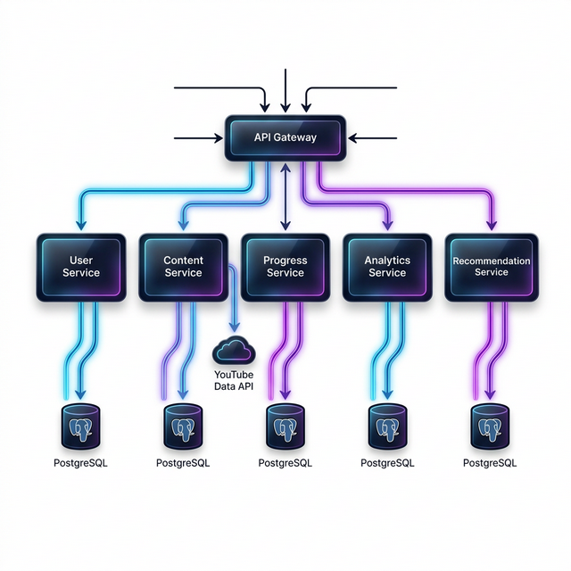
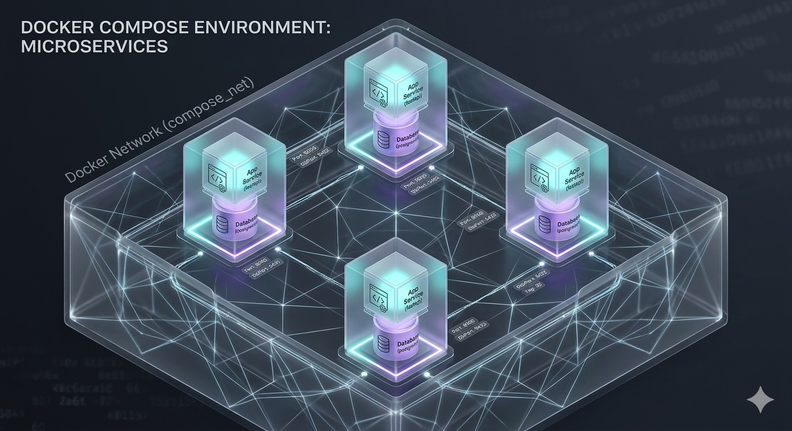

# 📺 YouTube Learning Platform Backend

A production-ready microservices ecosystem that transforms YouTube content into a structured learning environment. Featuring automated syncing, progress persistence, and an intelligent recommendation engine.

---

## ⚡ Project at a Glance

| Component             | Technology Stack              | Purpose                                    |
| :-------------------- | :---------------------------- | :----------------------------------------- |
| **API Gateway**       | FastAPI + SlowAPI             | Unified Entry, Proxying, Rate Limiting     |
| **User Service**      | FastAPI + PostgreSQL          | Learner Identity & Profile Management      |
| **Content Service**   | FastAPI + YouTube API v3      | "Lazy-Load" Video/Playlist Caching         |
| **Progress Service**  | FastAPI + Background Tasks    | Watch-time tracking & Analytics-triggering |
| **Analytics Service** | FastAPI + SQL Analytics       | Drop-off analysis & Popularity metrics     |
| **Recommendation**    | FastAPI + Service Aggregation | Personalized "Watch Next" Logic            |

---

## 🏗️ Technical Architecture

---

## 🛠️ Developer API Guide (Frontend Cheat-Sheet)

### 🔑 core Interaction Flow

Use this table to understand the exact JSON payloads and endpoints required for building the UI.

| Service       | Method | Endpoint               | Payload / Params                                                                       | Why call this?                                                |
| :------------ | :----- | :--------------------- | :------------------------------------------------------------------------------------- | :------------------------------------------------------------ |
| **User**      | `POST` | `/users`               | `{"email": "string"}`                                                                  | Register a new learner.                                       |
| **Content**   | `GET`  | `/playlist/{id}`       | _None (ID in URL)_                                                                     | Sync/Load a course curriculum.                                |
| **Content**   | `GET`  | `/video/metadata/{id}` | _None (ID in URL)_                                                                     | Get video details + **Player Iframe**.                        |
| **Progress**  | `POST` | `/video/progress`      | `{"user_id": "...", "video_id": "...", "watched_seconds": 120, "event_type": "pause"}` | **The Main Event Call.** Saves progress & triggers analytics. |
| **Recommend** | `GET`  | `/recommend/{id}`      | `?user_id=...`                                                                         | Get the personalized next lesson.                             |
| **Analytics** | `GET`  | `/analytics/popular`   | `?limit=10`                                                                            | Show trending courses on Homepage.                            |

---

## 🧠 Business Logic & Database

### Database Schema (ERD)

### Intelligent Recommendation Engine

The Recommendation Service automatically determines the user's state using a prioritized logic tree:

| Priority        | State Detected           | Action                                                 |
| :-------------- | :----------------------- | :----------------------------------------------------- |
| **1. Resume**   | Found unfinished video   | Recommend resuming at exact timestamp.                 |
| **2. Sequence** | Finished previous lesson | Recommend the next video in the original playlist.     |
| **3. Discover** | Course 100% complete     | Recommend platform-wide Trending video from Analytics. |

---

## 🚀 Deployment & Setup

### Getting Started

1. **Environment:** Copy `.env.example` to `.env` and add your `YOUTUBE_API_KEY`.
2. **Launch:** Run `docker-compose up --build`.
3. **Docs:** Visit `http://localhost:8000/docs` to view the interactive Swagger UI.

---

## 💡 Key Design Patterns

- **Database per Service:** Total data isolation for independent scaling.
- **Asynchronous Background Tasks:** Progress updates trigger Analytics events without blocking the user.
- **Lazy Content Sync:** Fetches from YouTube only when a playlist is first accessed, then serves from local PostgreSQL.
